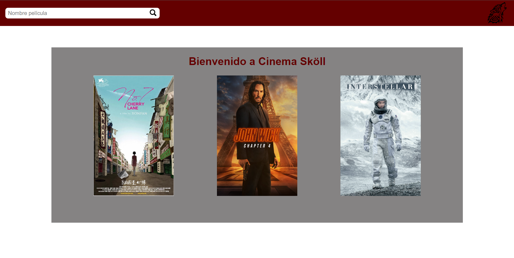
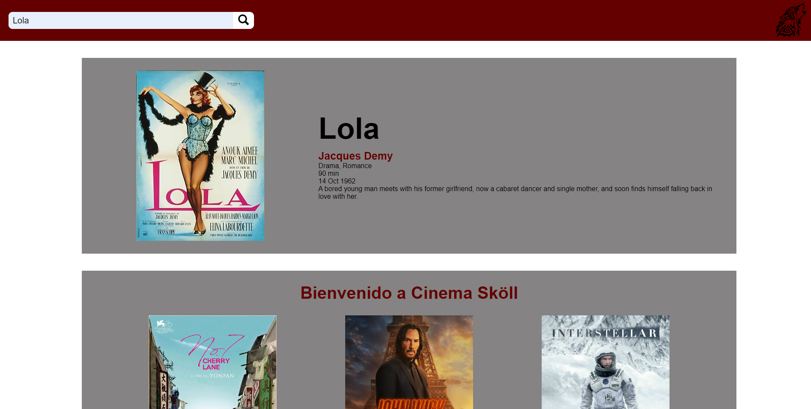

# TALLER 1: APLICACIONES DISTRIBUIDAS (HTTP, SOCKETS, HTML, JS,MAVEN, GIT)

**Estudiante:** Edwar Fabian Lozano Florez  
**Clase:** AREP  
**Profesor:** Luis Daniel Benavides

## Arquitectura
La aplicación cuenta con una arquitectura monolítica lo que hace que tanto el front como el back se ejecuen en el mismo servidor
(Localhost). Por otro lado también se emplea arquitectura por capas, separando la lógica en la capa de servicios, permitiendo así,
que en el controlador se puedan agregar más endpoints simplemente utilizando sus servicios.

Si se desea cambiar el proovedor del servicio (API), se puede realizar fácilmente debido a que la conexión se realiza desde
la clase **connectionService**, entonces para una nueva conexión únicamente se deberían cambiar los parametros de los objetos
que instancien esta clase. Además connectionService devuelve una conexión del tipo HTTPUrlConnection. Tambíen cuenta con una
sobrecarga de constructores lo que le permite crear la conexión a la nueva API o si esta llega a requerir parametros, por
ejemplo, una busqueda, también le permita realizar la conexión También se puede facilmente agregar una nueva funcionalidad
a partir de la información brindada por el nuevo proveedor.

## Testeo 
Se realizan 2 pruebas TDD, una comprobando que se pueda encontrar una pelicula por el nombre dado Y la otra que comprueba que
se pueda cambiar el poveedor de la información y la conexión siga siendo factible.

## USO
Para iniciar la aplicación se debe:
1. Ejecutar el meteodo **main** que se encuentra en la clase **Gateway**
2. Dirigirse al navegador y buscar: **localhost:8080/app.html**

Dentro de la aplicación se encontrará un interfaz muy sencilla con una barra de busqueda en la parte superior y la ventana de
bienvenida.

Para acceder a la información de la película deseada únicmanete se debe buscar su nombre en la barra de busqueda.
